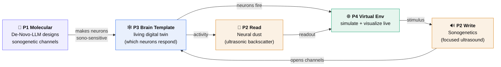
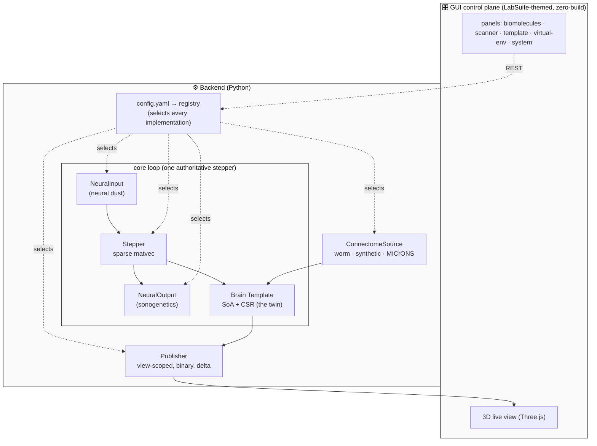
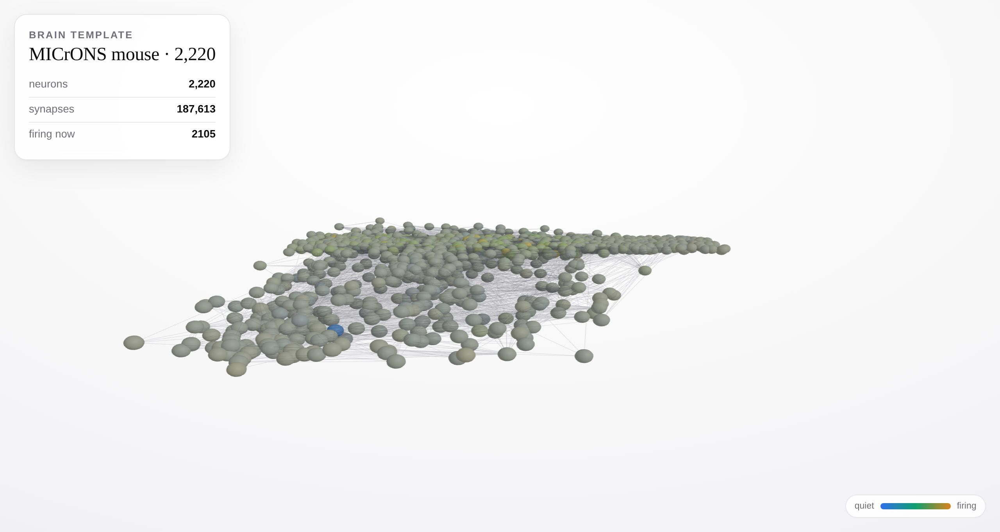
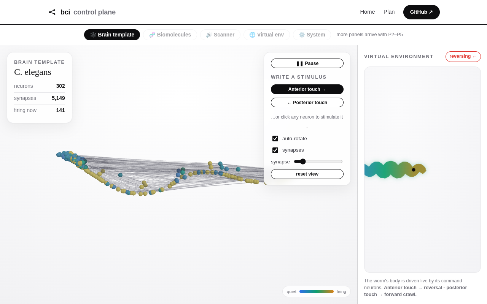

<div align="center">

# 🧠 Brain-Computer-Interface v1

### Bring a connectome to life — from a 302-neuron worm to the human brain.

**A configurable, scalable platform that designs the molecules, drives an ultrasound
read/write scanner, holds a living digital-twin of a brain, and runs it in a virtual
environment with live 3D visualization.**

[](LICENSE)
[](https://www.python.org/)
[](docs/PROJECT_PLAN.md)
[](backend/tests)
[](#-scalability-proven-not-promised)
[](#-the-scale-ladder)

[**🌐 Website**](https://sanjaydoc.github.io/Brain-Computer-Interface-v1/) ·
[**📖 Project Plan**](docs/PROJECT_PLAN.md) ·
[**🎛️ Control Plane**](https://sanjaydoc.github.io/Brain-Computer-Interface-v1/app/)

_Author: **Dr. Sanjay Anbu**_

</div>

---

> **Roadmap.** This is **v1** (public) — the live interfacing platform.
> The mapping science lives in [**Brain-Computer-Interface-v2**](https://github.com/sanjaydoc/Brain-Computer-Interface-v2) — a **private** repo.
>
> - **v2** — work in progress
> - **v3** — work in progress
> - **v4** — work in progress
> - **v5** — work in progress
> - **v6** — work in progress

---

## 📑 Table of contents

- [What this is](#-what-this-is)
- [The four parts, one loop](#-the-four-parts-one-loop)
- [System architecture](#-system-architecture)
- [Two foundational principles](#-two-foundational-principles)
- [Scalability, proven not promised](#-scalability-proven-not-promised)
- [The brain template](#-the-brain-template)
- [The scale ladder](#-the-scale-ladder)
- [The GUI control plane](#-the-gui-control-plane)
- [Quickstart](#-quickstart)
- [Project layout](#-project-layout)
- [Roadmap](#-roadmap)
- [Data sources & credits](#-data-sources--credits)

---

## 🔭 What this is

A brain-computer interface has **four parts**. This project builds all four as one
configurable system and **closes the loop in simulation first**, so that real hardware
and wet-lab components can plug into the *same interfaces* later — no rewrite.

| Part | Real-world layer | What it does | In this repo |
|:----:|------------------|--------------|--------------|
| **1 · Molecular** | Biomolecules | De-novo design of ion channels that make neurons ultrasound-sensitive | [De-Novo-LLM](https://github.com/sanjaydoc/De-Novo-LLM) design service |
| **2 · Hardware** | Ultrasound scanner | **Sonogenetics** to *write*, **neural dust** to *read* | signal I/O contracts + simulated adapters |
| **3 · Template** | The connectome | A living digital twin of a nervous system | pluggable source: worm / synthetic / MICrONS |
| **4 · Virtual env** | Simulation | Run the twin, drive it, and watch it live | sim engine + acoustic channel + 3D viz |

---

## 🔁 The four parts, one loop

The four parts aren't separate — they form a **single closed loop**. Molecules make
neurons ultrasound-sensitive; the scanner writes with focused ultrasound and reads with
neural dust; the template says which neurons carry the machinery; the virtual environment
runs the whole thing and shows it live.



> **Why simulation first?** Wet-lab molecules and physical ultrasound hardware can't be
> *coded*. But they can be represented as **strict I/O contracts** (`NeuralInput` /
> `NeuralOutput`). v1 ships simulated adapters; real devices implement the same contracts
> later. The loop is real in software before it's real in silicon.

---

## 🏛️ System architecture

Everything is a **registry-backed interface** selected by config. The backend runs the
brain; a thin GUI drives it. Nothing worm-specific leaks into the foundation.



---

## 🧱 Two foundational principles

Every module in the codebase obeys **two binding rules**. They are what make the climb
from 302 neurons to 86 billion a matter of *compute and config*, not rewrites.

### 1. Configurability — config selects *implementations*, not just values

```yaml
# profiles/synthetic_small.yaml
connectome:
  impl: synthetic          # ← swap for "celegans" or "microns"; nothing else changes
  params: { n: 1000, avg_degree: 10, seed: 0 }
```

Each layer (`ConnectomeSource`, `NeuronModel`, `Stepper`, `Renderer`, …) is a registry.
Adding a variant is **one class + one `@register` line** — never an edit to the core.

### 2. The Scalability Contract — nothing worse than O(E)

| Rule | Forbids |
|------|---------|
| **No per-element objects** — state is columnar arrays (SoA) | `class Neuron` in a list (dies ~1M) |
| **Sparse, never dense** — connectivity is CSR/COO | an 86B×86B matrix |
| **Linear or better** — ≤ O(N) neurons, O(E) synapses; **zero O(N²)** | all-pairs loops |
| **Bounded memory / out-of-core** — chunk / mmap / stream | materializing 500M synapses per frame |
| **Partition-native** — twin split into spatial chunks | a monolith that can't be distributed |

Full design → **[`docs/PROJECT_PLAN.md`](docs/PROJECT_PLAN.md)**.

---

## 📈 Scalability, proven not promised

A module isn't allowed to *call* itself scalable until it's benchmarked at millions of
neurons. Here is the **actual measured** build time of `SyntheticSource`, from 1,000 to
**10,000,000 neurons (100M synapses)** — staying near-linear, exactly as the contract
requires:

<div align="center">


</div>

| Neurons | Synapses | Build time |
|--------:|---------:|-----------:|
| 1,000 | ~10,000 | ~1 ms |
| 100,000 | ~1,000,000 | ~100 ms |
| 1,000,000 | ~10,000,000 | ~3.7 s |
| **10,000,000** | **~100,000,000** | **~10 s** |

> Reproduce it yourself: `.venv/bin/python scripts/make_figures.py`

---

## 🕸️ The brain template

The **Brain Template** is a *living digital twin* — the connectome plus its live per-neuron
state, held as Structure-of-Arrays + a sparse synapse matrix. Below is a real 300-neuron
synthetic connectome rendered from the actual data model (nodes = neurons in 3D space,
lines = synapses, color = out-degree):

<div align="center">


</div>

The same object scales: it's addressed by 3D coordinate (for the ultrasound scanner),
snapshot-able (save / load / rewind), and partition-native (splittable across machines).

---

## 🪜 The scale ladder

One code path, one North Star. Scaling up is **loading the next profile**, not a rewrite —
same engine, same renderer, same I/O contracts. Rungs 1–3 are live today.

| Rung | Source | Neurons | Synapses | Data status | In this repo |
|:----:|--------|--------:|---------:|-------------|-------------|
| 1 | **C. elegans** (worm) | 302 | ~7,000 | ✅ real & *complete* | ✅ bundled — default |
| 2a | **MICrONS** (mouse V1 mm³) | ~200,000 | ~500,000,000 | ✅ real EM | ✅ `scripts/fetch_microns.py` |
| 2b | **Drosophila** (FlyWire) | ~130,000 | ~50,000,000 | ✅ real EM | ✅ `scripts/fetch_drosophila.py` |
| 3 | **Mouse mesoscale** (region-modular) | **1e5 … 71M** | scales with N | ✅ statistical | ✅ `profiles/mouse.yaml` — proven to 1M |
| 4 | **🎯 Human** (North Star) | **~86,000,000,000** | **~10¹⁴** | statistical | 🎯 target |

Rung 1 ships with the repo. The Rung-2 brains are **fetched on your own machine** (their EM
hosts — CAVE and FlyWire — aren't reachable from the hosted demo); once cached they load from
the control-plane dropdown and render with automatic level-of-detail.

<div align="center">



**Rung 2a — real MICrONS mouse V1** · 2,220 proofread neurons and **187,613 real electron-microscopy synapses** from the Allen Institute's `minnie65_public` release, rendered and simulated live in the browser. Every edge is a synapse a human traced; the warm neurons are firing under the connectome's own dynamics.

</div>

**Rung 3** is where the ladder reaches millions. No one has an every-synapse map of a whole
brain, so this rung is *statistical*: it turns the Allen mesoscale **region graph** into a
neuron-level connectome at **any N** — distributing neurons across regions and wiring them by
region-to-region strength, so structure is **modular and spatially embedded**, not
uniform-random. It builds a brain-like procedural scaffold out of the box (`bci load
profiles/mouse.yaml`), swaps in the **real Allen matrix** via `scripts/fetch_mouse_mesoscale.py`,
and is proven headless at **1,000,000 neurons / 16M synapses in ~8 s under 1 GB** — the same
vectorized, sparse, O(N+E) assembly the human rung will use. See [RUN.md §5](RUN.md).

---

## 🎛️ The GUI control plane

A single web cockpit — **templated on [LabSuite](https://github.com/sanjaydoc/LabSuite)**
(zero-build, live + demo mode) — to run and manage all four parts. **Run the brain, write
a stimulus, and watch the worm react:** a stimulus ignites a cascade through the real
connectome (neurons light up), and the command neurons crawl a virtual worm — **anterior
touch → reversal, posterior touch → forward.**

<div align="center">



</div>

Try it live: **[control plane →](https://sanjaydoc.github.io/Brain-Computer-Interface-v1/app/)**
— press **▶ Run brain**, drive **AVB** (forward) or **AVA** (reverse), or click any neuron to stimulate it.
Panels: **Biomolecules** · **Scanner** · **Brain Template** · **Virtual Env** · **System**.

### ⚠️ Every worm movement is a genuine output of the connectome — no scripted logic

There is **no hand-authored behavior, no timers, no "if touched then reverse" gimmick**
anywhere in the worm's motion. The full chain is real:

1. A **leaky integrate-and-fire simulation** runs over the real 302-neuron connectome
   (per-neuron synaptic normalization + inhibition keep it structured). The network is
   **spontaneously active** — the command neurons fluctuate on their own.
2. **Locomotion is decoded live** from the command interneurons (forward AVB/PVC −
   reverse AVA/AVE/AVD). That decoded signal — and *only* that — sets the worm's
   direction and speed. A quiet brain → a still worm.
3. The body integrates the motor signal (neuromuscular smoothing) to crawl continuously.

Drive **AVA** and the worm reverses; drive **AVB** and it crawls forward — because that
is what the wiring does, verified by a test (`test_locomotion_emerges_from_command_neurons`).
The browser demo and the Python engine (`bci run`) run the **same** model.

---

## 🚀 Quickstart

Run the full cockpit locally in one command. Full command reference: **[RUN.md](RUN.md)**.

**Windows (PowerShell):**
```powershell
git clone https://github.com/sanjaydoc/Brain-Computer-Interface-v1.git
cd Brain-Computer-Interface-v1
python -m venv .venv
Set-ExecutionPolicy -ExecutionPolicy Bypass -Scope Process   # allow venv activation (this window only)
.\.venv\Scripts\Activate.ps1
pip install -e ".[dev,api]"
bci serve
```
> No activation? Skip the two middle lines and call the venv Python directly:
> `.\.venv\Scripts\python.exe -m pip install -e ".[dev,api]"` then `.\.venv\Scripts\python.exe -m bci.cli serve`

**macOS / Linux:**
```bash
git clone https://github.com/sanjaydoc/Brain-Computer-Interface-v1.git
cd Brain-Computer-Interface-v1
python3 -m venv .venv
source .venv/bin/activate
pip install -e ".[dev,api]"
bci serve
```

Then open **http://localhost:8000/app/** — the live control plane (run the brain, generate
biomolecules, deliver ultrasound, tune it live). See **[RUN.md](RUN.md)** for `bci load` /
`bci run` / `pytest` and enabling real De-Novo-LLM generation.

---

## 🗂️ Project layout

```
Brain-Computer-Interface-v1/
├── backend/
│   ├── bci/
│   │   ├── registry.py        # the configurability spine — swappable seams
│   │   ├── config.py          # typed, validated profiles (Pydantic)
│   │   └── connectome/        # Brain Template: SoA + CSR model, sources
│   │       ├── schema.py      #   Connectome (arrays + sparse matrix)
│   │       ├── base.py        #   ConnectomeSource interface + registry
│   │       └── synthetic.py   #   SyntheticSource (vectorized, scalable)
│   └── tests/                 # correctness + the 1M-neuron scalability test
├── profiles/                  # config profiles — pick one to run
├── scripts/make_figures.py    # regenerate the README graphs from live data
├── docs/
│   ├── PROJECT_PLAN.md        # the complete architecture & design
│   ├── index.html + app/      # GitHub Pages site (LabSuite theme)
│   └── media/                 # generated figures + screenshots
└── .github/workflows/         # CI: auto-deploy Pages
```

---

## 🧭 Roadmap

- ✅ **P0 — Spine** · config + registry, connectome SoA/sparse model, synthetic source, **10M-neuron proof**
- ✅ **P1 — Worm** · real *C. elegans* connectome (Cook 2019 + OpenWorm) loads + **renders in 3D**
- ✅ **P2 — Simulation** · Python LIF engine + sparse stepper; **locomotion emerges from the connectome**
- ✅ **P3 — Live** · FastAPI + WebSocket streaming (`bci serve`); browser demo-mode mirror
- ✅ **P4 — Loop** · sonogenetic write + neural-dust read contracts + stimulus environment (the four-part loop)
- ✅ **P5 — Cockpit** · all GUI panels interactive: **Biomolecules** (generate → test), **Scanner** (ultrasound write + dust read, live), **System** (live monitor + brain-tuning sliders) + CI
- ✅ **Part 1 wired** · **De-Novo-LLM** integrated — generate biomolecules → cast as sonogenetic channels → **test on the connectome** (local GPU / NVIDIA NIM / bundled fallback)
- ✅ **Hodgkin–Huxley model** · biophysical neuron model, drop-in behind the same `NeuronModel` interface
- ✅ **Rung 2 — big brains** · **MICrONS** mouse cortex (~200 k) + **Drosophila** (FlyWire) sources, LOD renderer (GPU point cloud + sampled synapses), local fetch scripts, control-plane dropdown
- ✅ **Rung 3 — mesoscale to millions** · region-modular **mouse mesoscale** source (Allen region graph → neuron-level connectome at any N), **proven to 1 M neurons headless**, procedural scaffold + real-Allen fetch script, live in the dropdown

**v1 complete — the full four-part loop is real, and the ladder is climbing.** Rungs 1–3 load today (worm bundled; MICrONS + Drosophila fetch locally; mesoscale scales to millions). Next horizon: a GPU stepper for the mesoscale/human rungs.

### Running the molecular pipeline locally
The hosted demo uses bundled samples (a browser can't run PyTorch). On your own machine:
```bash
pip install -e /path/to/De-Novo-LLM      # your trained checkpoints → real generation
export NVIDIA_API_KEY=nvapi-...           # optional: NVIDIA NIM / BioNeMo cloud
bci serve                                 # the GUI Biomolecules panel now shows "live"
```
- [ ] **P5 — Cockpit** · full GUI control-plane panels + polish

---

## 📚 Data sources & credits

- **Connectome data** — [OpenWorm](https://openworm.org/) (*C. elegans*, 302 neurons with 3D positions) · [MICrONS](https://www.microns-explorer.org/) (mouse visual cortex).
- **Molecular engine** — [De-Novo-LLM](https://github.com/sanjaydoc/De-Novo-LLM).
- **GUI theme** — adapted from [LabSuite](https://github.com/sanjaydoc/LabSuite).

**Author:** Dr. Sanjay Anbu · **License:** [MIT](LICENSE)

<div align="center"><sub>Built to climb from a worm to the human brain — one scalable module at a time.</sub></div>
